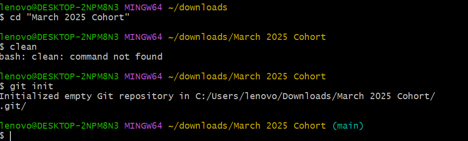
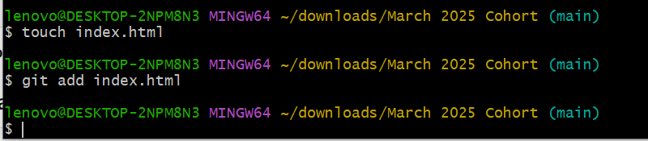
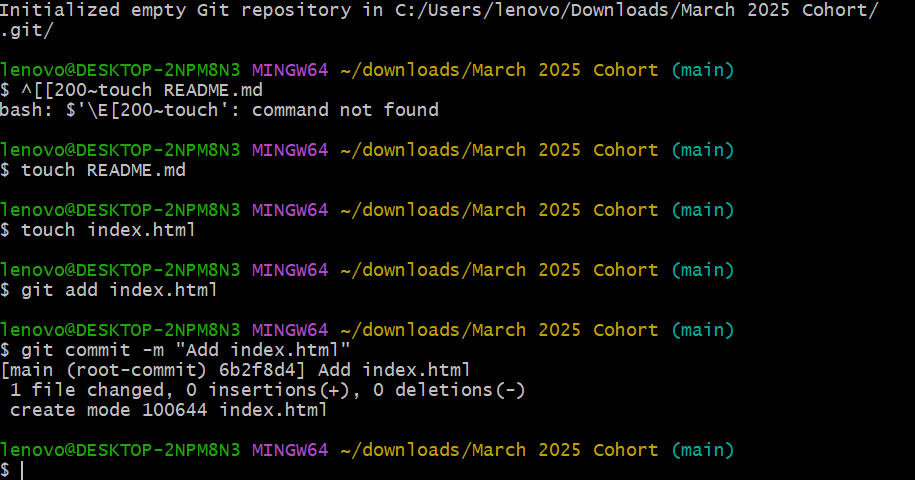
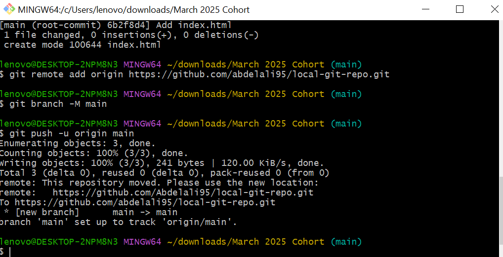
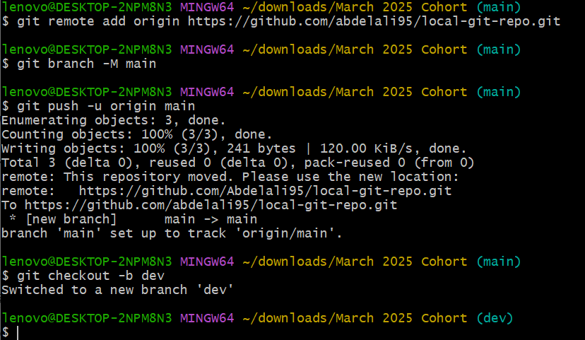
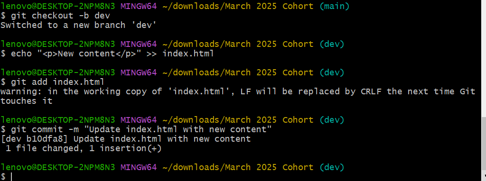
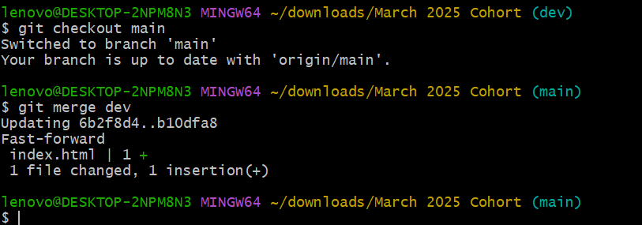
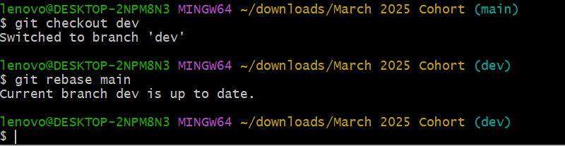

# Local Git Repo Assignment

## Part 1: git init

## Part 2: git add

## Part 2: git commit

## Part 3: git remote add & git push

## Part 4: git branch and checkout dev

## Part 4: commit changes on dev branch

## Part 5: git merge dev into main

## Part 5: git rebase dev onto main

